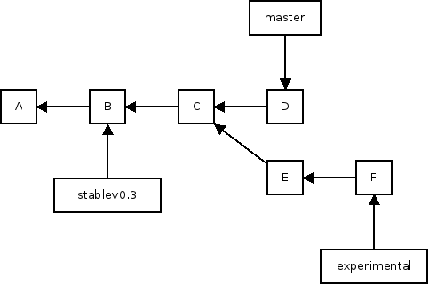

branching
=========

---

# branching

* lightweight (creating a branch requires 40 bytes of space)
* pointers to different commits
* conveneint ways to separate tasks and features

---

# develop asynchronously
	*   5a376b1 - Merge branch 'master' of github.com:boto/boto
	|\
	| * 2f03097 - Adding ref/dynamodb to hidden TOC.
	| *   649bad2 - Merging in @rdodev's DynamoDB tutorial and adapting it for Layer2
	| |\
	| | * d5defb8 - Little changes
	| | * 0a5046c - Starting point. We can add more details later on.
	| | * a99fb2e - Grammar fix
	| | * d5d3edb - Minor redaction edits
	| | *   e5a397f - Merge branch 'master' of git@github.com:rdodev/boto.git
	| | |\
	| | | * 8c19b40 - Fixing code example
	| | * | f35a84d - Added subsections

# merge branches whenever

---

# sample branching

---
