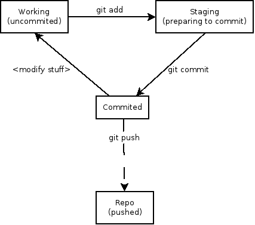

Git Crash Course
=========

---

# Git is...
* distributed (redundant)
* flexibile
* network independent
* a collection of "commits" that represent changes to code

---

# Git is great for...
* massive projects (linux kernel...)
* fast and cheap branching
* speed (almost everything is local)
* working on planes, trains, and automobiles

---

# a commit is...
* snapshot, not a diff
* takes up more space, but bits are cheap
* acts almost like a mini filesystem
* store links to files that haven't changed
* refer to commits by checksums (not names)

---

# stop worrying
* Git (generally) only adds data
* it's hard to lose things once committed
* almost always possible to roll back changes
* other than 'fetch', 'push', and 'pull', nearly everything is local

---

# three (or four) stages of Git #

---

# basic workflow #
1. ### make some changes
1. ### stage snapshots of files
1. ### commit
1. ### (eventually) push

---

# a commit has...
* a checksum
* all blobs contained in the commit
* a comment (please use these)

Format your commit like:

	80 character summary
	
	longer description of
	changes, maybe include a bulleted
	list of changes you made

